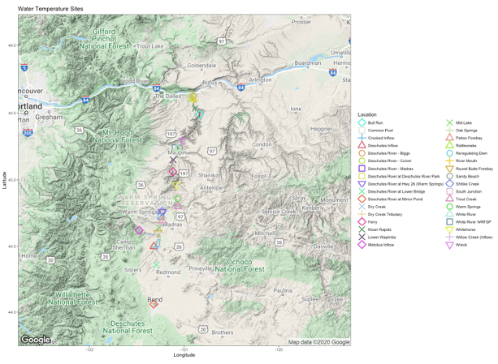

```{r}
library(knitr)
library(kableExtra)
kable(MadrasDataYearly,  format = "html")
```


## Introduction
This application is designed to interactively visualize river water quality data collected by USGS and uses supplemental data from PGE, ODEQ, and ODFW to provide a platform for performing and reviewing aquatic life use based water quality assessments based on available river quality data.
<br>

## Data
All data used by this application are available through either PGE, USGS, ODEQ, or ODFW, files used for predictive analysis are available at github.com/itsthesnake/DSPG
The data used in this application are collected at USGS monitoring locations in Moody, OR and Madras, OR with coordination from the Bonneville Power Administration (BPA) and Portland General Electric (PGE) respectively. Fish measurements are taken using publicly available data from PGE at https://www.portlandgeneral.com/corporate-responsibility/environmental-stewardship/water-quality-habitat-protection/fish-counts-fish-runs/deschutes-daily-fish-counts.
River water quality parameters vary from source to source but typically include temperature, dissolved oxygen, pH, or turbidity in some capacity at regular depth intervals.
Data have been pre-processed to ensure consistency in parameter names and units
and to calculate frequencies of exceedance of water quality criteria and widths of suitable habitat for fish based on
areas meeting dissolved oxygen and temperature criteria for that waterbody.
<br>

## Application usage
The application has two main inputs: a map and a table. To build plots for any individual site, click on your desired site in either the map or the table.  

The map shows all sites with profile data available. The table shows all of those sites and their associated uses and assessments for each parameter.  

The map and table inputs are responsive to each other. When you click a site on the map, the table will automatically filter to assessments associated with that site.
When you click on a row in the table, the map will automatically fly to that site location.  

Plots specific to that site will be rendered automatically. Several data plotting and review options are available.
Outputs will automatically render any time the user updates one of the input widgets.
<br>

## Map elements
Individual monitoring locations are displayed as circle markers on the map.
In addition to displaying sites, site labels and polygons identifying assessment unit, beneficial use, and site-specific standard boundaries are also available. Topographic and satellite base layers are both available. 
To turn on any of these layers, hover the mouse over the layers control box (top left of map, under zoom buttons) and select one or more layers.
Features are searchable by site and assessment unit names or identifier codes. To search for a feature, click the magnifier glass (top left of map, under the layers control box) and start topping.
Locations matching your search will appear as you type.  

  
Figure 1. Map usage guide.
<br>


## Outputs
### Time series
The "Time series" tab shows three outputs summarizing patterns in temperature, dissolved oxygen, and pH across depth and time at the selected site.
<br>

#### Temperature
The "Temperature" plot shows an 
<br>
<br>

#### Temperature projections
The "Habitable width" plot shows the 
<br>
<br>

#### Fish Population Projections
The "Fish Population Projections" plot shows the 
<br>


### Individual profiles
The "Individual profiles" tab shows two outputs for a single profile collected at the selected site and date.
The first is a plot of temperature, dissolved oxygen, and pH against depth. On the single orofile plot applicable criteria for each parameter are plotted as horizontal lines
with colors corresponding to the colors used for plotting parameter points. The second output is a scrollable table of the data from that profile used to generate the plot.
In the profile table, cells are colored orange when a water quality criterion is exceeded for that parameter at that depth.
<br>

## Package dependencies & credits
This application depends on functions contained within the [tidyverse, dplyr, and wqTools R-package (https://github.com/utah-dwq/wqTools)]
Special thanks to R packages leaflet, leaflet.extras, and Shiny.  

### Package dependencies:  
```
	leaflet,
	RColorBrewer,
	akima,
	jsonlite,
	leaflet.extras,
	lubridate,
	mapedit,
	magrittr,  
	plyr,
	rLakeAnalyzer,
	reshape2,
	sf,  
	shinycssloaders,  
	DT
```

## Help & feedback
For additional help or to submit feedback or bug reports, please contact:  
Duncan Gates
Data Science for the Public Good
gatesdu@oregonstate.edu
971-413-3852